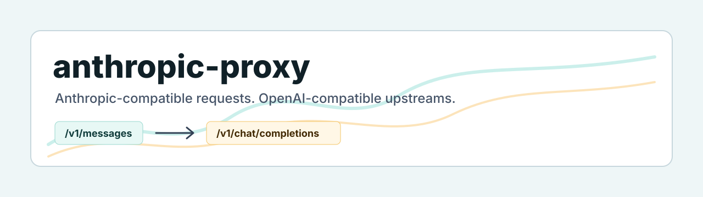

# anthropic-proxy

[](https://github.com/thomas-illiet/anthropic-proxy/actions/workflows/ci.yml)
[](https://github.com/thomas-illiet/anthropic-proxy/releases/latest)
[](go.mod)
[](https://github.com/thomas-illiet/anthropic-proxy/pkgs/container/anthropic-proxy)
[](LICENSE)



Use Claude Code with OpenAI-compatible model providers through an Anthropic-compatible local proxy.

`anthropic-proxy` exposes the Anthropic Messages API shape expected by Claude Code and forwards requests to an OpenAI-compatible chat completions endpoint. It is built for two simple setups: a local proxy on a developer machine, or a shared proxy on a server for a team.

- Run Claude Code against OpenAI-compatible providers such as NVIDIA, OpenRouter, vLLM, LiteLLM, Ollama-compatible gateways, or other Chat Completions endpoints.
- Keep Anthropic-compatible client requests while routing to the upstream model names you choose.
- Use local binaries, Docker Compose, or a shared server deployment.
- Stream responses as Anthropic-compatible SSE, including tool-call translation modes.
- Expose health, model discovery, token counting, and Prometheus-style metrics endpoints.

## Quick Start

```bash
cp .env.example .env
```

Edit `.env` and set the upstream model:

```bash
ANTHROPIC_PROXY_DEFAULT_MODEL=your-upstream-model
```

Set `ANTHROPIC_PROXY_UPSTREAM_API_KEY` only when your upstream provider requires a bearer token.

Start the proxy:

```bash
make build && ./anthropic-proxy serve
```

In another terminal, point Claude Code at the proxy:

```bash
export ANTHROPIC_BASE_URL=http://localhost:8787
export ANTHROPIC_API_KEY=anything
export CLAUDE_CODE_ENABLE_GATEWAY_MODEL_DISCOVERY=1
claude
```

Check the local API:

```bash
curl http://localhost:8787/health
curl http://localhost:8787/v1/models
```

If `ANTHROPIC_PROXY_CLIENT_KEY` is set, use that exact value as `ANTHROPIC_API_KEY`.

## Why?

Claude Code speaks to Anthropic-compatible APIs. Many hosted and self-hosted model gateways expose OpenAI-compatible Chat Completions instead. `anthropic-proxy` bridges that gap without changing the Claude Code workflow.

Use it when you want to:

- try Claude Code with an OpenAI-compatible upstream provider;
- keep Anthropic-compatible requests on the client side;
- force every Claude model request to one upstream model;
- map Claude-visible model aliases such as `sonnet`, `opus`, or `haiku` to different upstream models.

## Install

### GitHub Release

Download the latest archive for your OS from [GitHub Releases](https://github.com/thomas-illiet/anthropic-proxy/releases/latest), unpack it, copy `.env.example` to `.env`, and run:

```bash
./anthropic-proxy serve
```

On Windows, run `anthropic-proxy.exe serve`.

### Docker Compose

```bash
cp .env.example .env
docker compose up --build
```

The Docker image does not define default `ANTHROPIC_PROXY_*` environment variables. Provide configuration at runtime with Compose `env_file`, `environment`, or your orchestrator.

### Build From Source

```bash
git clone https://github.com/thomas-illiet/anthropic-proxy.git
cd anthropic-proxy
cp .env.example .env
make build
./anthropic-proxy serve
```

## CLI

```bash
anthropic-proxy serve
anthropic-proxy version
anthropic-proxy --help
```

The root command only prints help. The server starts only through `anthropic-proxy serve`.

Configuration is loaded once at startup from real `ANTHROPIC_PROXY_*` environment variables and an optional `.env` file in the current working directory.

## Documentation

- [Getting Started](docs/getting-started.md)
- [Server Deployment](docs/guides/server-deployment.md)
- [Configuration Reference](docs/reference/configuration.md)
- [API Reference](docs/reference/api.md)
- [Architecture](docs/architecture.md)

## Contributing

Issues and pull requests are welcome. Start with [CONTRIBUTING.md](CONTRIBUTING.md) for local checks, coding style, and PR expectations.

## License

MIT. See [LICENSE](LICENSE).
