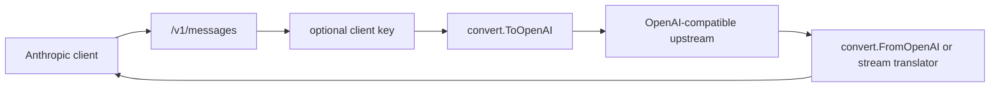

# Architecture

`anthropic-proxy` is intentionally small. The v1 layout keeps CLI, config, HTTP lifecycle, proxy handlers, and format conversion separate.

## Packages

| Path | Responsibility |
|---|---|
| `main.go` | Root entrypoint that calls the CLI package. |
| `internal/cli` | Cobra commands: root help, `serve`, and `version`. |
| `internal/config` | Viper-backed loading from current `.env` and `ANTHROPIC_PROXY_*` env vars. |
| `internal/server` | `http.Server`, timeouts, signal handling, and graceful shutdown. |
| `internal/proxy` | HTTP routes, auth, metrics, upstream calls, sync and streaming translation. |
| `internal/convert` | Anthropic/OpenAI request and response conversion. |
| `internal/anthropic` | Anthropic-compatible types and error helpers. |
| `internal/logging` | Structured leveled logging. |

## Request Flow

## CLI Flow

`main.go` calls `cli.Execute`. The root command prints help by default. `serve` loads configuration, creates a logger, logs non-secret startup settings, then calls `internal/server.Run`.

There is no implicit server start from the root command and no config-path flag.

## Streaming

The proxy accepts OpenAI-compatible SSE chunks from upstream and emits Anthropic-compatible SSE events. Shared helpers handle upstream request creation, response headers, chunk scanning, usage fallback, and upstream error responses.

Native tool mode accumulates OpenAI tool-call deltas until the stream finishes. XML mode buffers text until a complete `<tool_code>` block can be parsed, then emits Anthropic `tool_use` blocks.
